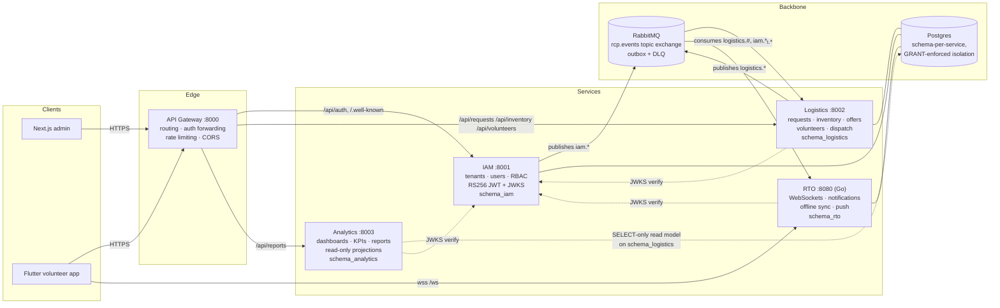

# Migration Summary — Legacy Monolith → Microservice Architecture

Completed 2026-07. The legacy single-service FastAPI backend
(`RCP-api/backend`) has been fully decomposed and **deleted**. Every piece
of business functionality now lives in exactly one bounded context.

## Architecture

Trust model: IAM signs RS256 JWTs; every service verifies them locally
against IAM's JWKS (cached, kid-rotation aware). The gateway forwards the
`Authorization` header untouched — it never decodes or mints tokens.

## Where the legacy monolith went

| Legacy (`RCP-api/backend/app/…`) | New owner |
|---|---|
| `api/routes_auth.py`, `core/security.py`, `models/{tenant,user}.py`, `schemas/{tenant,user}_schema.py` | `services/iam` |
| `api/routes_{requests,inventory,volunteers}.py`, `services/{requests,inventory,dispatch}.py`, `models/{resource,request,offer,task,volunteer}.py`, `schemas/{request,resource,task}_schema.py` | `services/logistics` |
| `api/routes_reports.py`, `services/reporting.py` | `services/analytics` (via logistics; see below) |
| `websockets/*`, `models/notification.py` | `services/rto` (rewritten in Go) |
| `middlewares/tenant_context.py` | retired — tenancy is carried in the JWT (`tenant_id` claim) and enforced per service |
| `alembic/*` | superseded by per-service `migrations/` |

The IAM/Logistics/RTO split predated this change (commit `1c03490`). This
migration finished the job: analytics extraction, API gateway, shared
packages, monitoring, and deletion of all legacy code.

## Files moved in this migration

- `services/logistics/app/api/routes_reports.py` → `services/analytics/app/api/routes_reports.py`
  (same endpoints, paths, and role requirements — API preserved)
- `services/logistics/app/services/reporting.py` → `services/analytics/app/services/reporting.py`
   (rewritten as analytics-owned projection queries over `schema_analytics`; the
   analytics consumer materializes logistics events into that schema)
- `services/logistics/app/core/auth.py` (JWKS verify, ~80 vendored lines) →
  `packages/common/rcp_common/auth.py`; the logistics module now just binds
  it to its settings

## Deleted

- `RCP-api/` — entire legacy tree (49 tracked files: `app/main.py`, `api/`,
  `services/`, `models/`, `schemas/`, `websockets/`, `middlewares/`,
  `core/`, `db/`, `alembic/`, `requirements.txt`, `Dockerfile`, `tests/`,
  plus the untracked local `venv/` and `.env`)
- `packages/py-shared/` — placeholder superseded by `packages/common`
- `services/logistics/app/api/routes_reports.py`,
  `services/logistics/app/services/reporting.py` — moved to analytics

## Created

**`packages/common`** (`rcp-common`): `pyproject.toml`, `rcp_common/{logging,middleware,exceptions,config,auth}.py`, `README.md`
**`packages/clients`** (`rcp-clients`): `pyproject.toml`, `rcp_clients/{base,iam,logistics,analytics}.py`, `README.md`
**`services/analytics`**: full service — `app/{main.py, core/config.py, api/{routes_reports,dependencies}.py, db/{base,database}.py, models/projection.py, services/reporting.py}`, `migrations/` (alembic env + `a1c3e5f70001_init_analytics`), `tests/test_health.py`, `Dockerfile`, `requirements.txt`, `alembic.ini`, `.env.example`
**`gateway`**: `app/{main.py, core/config.py, proxy.py, ratelimit.py}`, `tests/test_gateway.py`, `Dockerfile`, `requirements.txt`, `.env.example`
**`infra`**: `docker/README.md`, `monitoring/prometheus/prometheus.yml`, `monitoring/grafana/{provisioning/*, dashboards/platform-overview.json}`, `compose/docker-compose.monitoring.yml`
**CI**: `.github/workflows/{ci-analytics,ci-gateway}.yml`
**Docs**: this file

## Modified

- `services/{iam,logistics}`: structured JSON logging + X-Request-ID
  middleware from `rcp_common`; configs subclass `BaseServiceSettings`;
  Dockerfiles build from the repo root and install `packages/common`
- `services/rto`: all logging converted to `log/slog` JSON (compiles clean)
- `infra/compose/db-init/01-schemas-roles.sql`: added `schema_analytics` +
  `svc_analytics` (SELECT-only grant on `schema_logistics`, incl. default
  privileges for future logistics tables)
- `infra/compose/docker-compose.yml`: added `gateway` (:8000) and
  `analytics` (:8003); Python services build with repo-root context
- `.github/workflows/{ci-iam,ci-logistics}.yml`: install `packages/common`,
  build with repo-root context, trigger on `packages/common/**`
- `Makefile`: `up-monitoring`, `install-packages`, `migrate-analytics`,
  analytics in `check-python`
- `README.md`, `docs/microservice-folder-structure.md`,
  `docs/architecture-blueprint.md`, `.gitignore` (`venv/`, `*.egg-info/`)

## Compliance checklist

| Requirement | Status |
|---|---|
| Independently deployable, own Dockerfile, own config | ✅ all five deployables |
| Own database migrations | ✅ alembic (iam, logistics, analytics), SQL (rto); gateway owns no data |
| Health endpoints | ✅ `/health` everywhere + `/health/services` aggregate on the gateway |
| Structured logging | ✅ JSON via `rcp_common.logging` (Python) and `slog` (Go) |
| OpenAPI docs | ✅ FastAPI `/docs` on gateway, iam, logistics, analytics |
| No business logic in gateway / RTO / analytics | ✅ routing only / delivery only / read-only queries |
| Shared code only in `packages/` | ✅ JWKS auth, logging, middleware, config, clients |

## Remaining TODOs

1. **Existing local Postgres volumes** predate `schema_analytics`: run the
   new statements from `infra/compose/db-init/01-schemas-roles.sql` against
   the volume once, or `docker compose down -v && make up`.
2. **Distributed tracing export**: `traceparent` propagation is now in place,
   but production still needs an OpenTelemetry pipeline (Jaeger/Tempo or
   equivalent) to visualize full end-to-end traces.
3. **Gateway rate limiting deployment**: Redis-backed shared counters are
   implemented, but production should set `REDIS_URL` and run Redis so the
   limiter stays correct across multiple gateway replicas.
4. **WebSocket front door**: the gateway now proxies `/ws`, but if a single
   origin is required in production, front the gateway and RTO with the same
   edge proxy / ALB / ingress configuration.
5. **Old JWTs & tests**: iam/logistics test suites are still light-weight
   scaffolds; extend them before release.
6. `docs/architecture-blueprint.md` still describes a `ts-shared` package
   and codegen pipeline that have not been built.
