# Resource Coordination Platform (RCP) — Software Architecture and Design Document (SDD / SAD)

**Document Version:** 1.0.0  
**Date:** August 4, 2026  
**Status:** Approved for Implementation  
**Standard Compliance:** Based on P. Kruchten's "4+1 View Model of Architecture" (IEEE Software, 1995) and Software Engineering Architectural Design Specifications.

---

## Table of Contents
1. [Executive Summary & Document Overview](#1-executive-summary--document-overview)
2. [Architectural Framework — Kruchten’s 4+1 View Model](#2-architectural-framework--kruchtens-41-view-model)
3. [Use-Case View (Scenarios)](#3-use-case-view-scenarios)
4. [Logical View](#4-logical-view)
5. [Process View](#5-process-view)
6. [Data Schema View](#6-data-schema-view)
7. [Development View (Implementation View)](#7-development-view-implementation-view)
8. [Physical View / Deployment View](#8-physical-view--deployment-view)
9. [Interfaces Specification](#9-interfaces-specification)
10. [Size, Scale, and Performance](#10-size-scale-and-performance)
11. [Quality Attributes & Non-Functional Requirements](#11-quality-attributes--non-functional-requirements)
12. [Architectural Patterns & Design Styles](#12-architectural-patterns--design-styles)
13. [Architectural Mappings & Traceability](#13-architectural-mappings--traceability)

---

## 1. Executive Summary & Document Overview

### 1.1 Purpose of the Software Design Document (SDD)
The **Software Design Document (SDD)**, also packaged as a **Software Architecture Document (SAD)**, captures the complete architectural blueprint and design specification for the **Resource Coordination Platform (RCP)**. The RCP is a SaaS multi-tenant, event-driven, offline-first backend platform designed for community-based organizations (CBOs) to coordinate relief during localized crises (resource requests, inventory tracking, volunteer dispatch, and real-time operations).

This document provides a single, authoritative reference for system engineers, software architects, backend developers, integrators, and project managers.

### 1.2 The Need for Multiple Architectural Views
System architecture and design is inherently multi-dimensional. A single, monolithic diagram cannot capture all facets of a complex software system. As established in architectural design principles, software structure spans:
* **Code structure:** Static organization of modules, interfaces, and packages.
* **Run-time structure:** Dynamic interactions between objects, components, and services.
* **Process structure:** Execution threads, processes, concurrency, and synchronization.
* **Work breakdown structure:** Development artifacts, build targets, and source code ownership.

To address these distinct structural aspects, this SDD employs multiple complementary **Design Views (Architectural Views)** to ensure complete clarity and eliminate ambiguity.

---

## 2. Architectural Framework — Kruchten’s 4+1 View Model

### 2.1 The 4+1 Architectural View Model
This document adopts **Philippe Kruchten's "4+1 View Model of Architecture"** (*IEEE Software*, Vol. 12, No. 6, Nov 1995, pp. 42–50). The 4+1 model organizes software design into five concurrent views tailored to different system stakeholders:

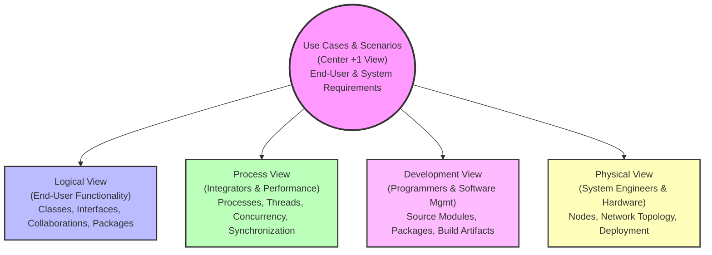

### 2.2 View Mapping to System Stakeholders

| View | Primary Stakeholders | Concerns Addressed | Key UML & Design Artifacts |
|---|---|---|---|
| **Use-Case View** | End-Users, Product Owners | Architecturally significant functionality, critical risks, quality requirements | Use Case Diagrams, Use Case Realizations |
| **Logical View** | Software Designers, Architects | Structural design, domain model, class hierarchies, component interfaces | Class Diagrams, Component Diagrams, Collaboration Diagrams |
| **Process View** | System Integrators, Performance Engineers | Concurrency, thread safety, process boundaries, execution flow, throughput | Sequence Diagrams, Activity Diagrams (Forks/Joins) |
| **Development View** | Programmers, DevOps | Package management, module dependencies, source code structure, build targets | Package Diagrams, Component/Artifact Diagrams |
| **Physical View** | Systems Engineers, Infrastructure Engineers | Hardware topology, network protocols, cloud nodes, server deployment | Deployment Diagrams, Network Node Diagrams |

---

## 3. Use-Case View (Scenarios)

### 3.1 Architecturally Significant Use Cases
While the final product contains dozens of administrative use cases, the **Architecturally Significant Use Cases** are those that shape the core architecture, carry major operational risks, or define non-functional quality requirements (performance, offline sync, security, reliability):

1. **UC-01: Onboard Tenant & Bootstrap Admin (IAM)** — Multi-tenant isolation setup, key issuance, seed admin user creation.
2. **UC-02: Submit Help Request & Apply Dynamic Workflow (Logistics)** — End-user crisis request submission, dynamic JSON schema validation, state machine verification.
3. **UC-03: Inventory Reservation & Pledged Offer Allocation (Logistics)** — Atomic inventory reservation under high concurrency (`SELECT FOR UPDATE`), preventing double-allocation.
4. **UC-04: Dispatch Task to Volunteer & Real-Time Notification (Logistics → Broker → RTO)** — Coordinator dispatches task; fat event published to RabbitMQ outbox; RTO consumes event and delivers via WebSocket / FCM.
5. **UC-05: Offline Cursor Replay & Sync (RTO ← Flutter Client)** — Volunteer mobile client re-establishes connection in low-bandwidth zone; replays change log using monotonic `sync_cursor`.

### 3.2 Use Case Diagram
The following diagram illustrates the primary actors (Super Admin, Tenant Admin, Coordinator, Volunteer) and their interactions with the system, highlighting `<<include>>` and `<<extend>>` dependencies.

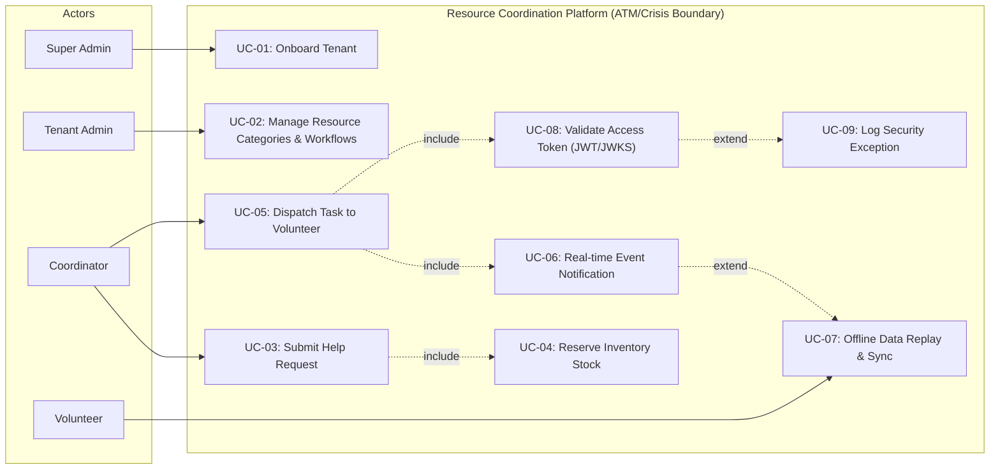

---

## 4. Logical View

### 4.1 Subsystem & Layered Decomposition
The Logical View presents the static structural design of RCP. The system is decomposed into three primary backend microservices (`IAM`, `Logistics`, `RTO`), a read-only `Analytics` service, and an `API Gateway`, backed by a shared Contracts specification.

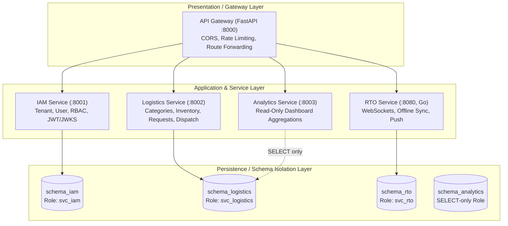

### 4.2 Class Diagram (Boundary, Control, Entity Stereotypes)
Following standard UML design patterns (Boundary-Control-Entity), the class diagram below demonstrates how request processing, business rules, and entity state are structured across the core domain services.

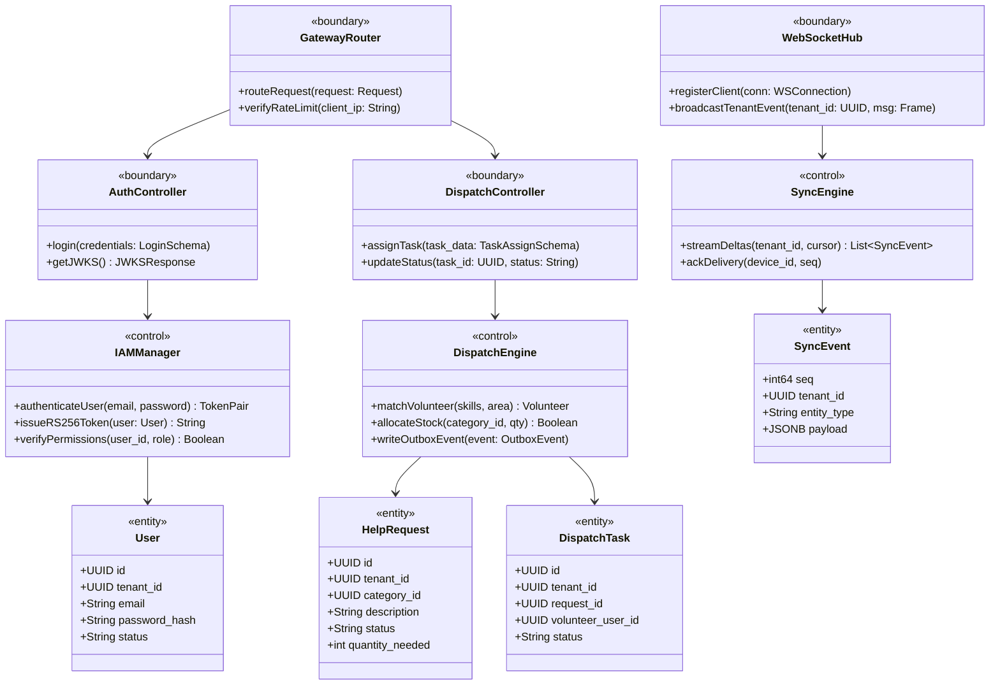

### 4.3 Component Diagram
The Component Diagram details provided and required interfaces, component responsibilities, non-functional properties, and mandated technologies.

```mermaid
graph TD
    subgraph "API Gateway Component"
        [Gateway]:::comp
        I_GW_REST(("Provided: REST API /api/*"))
    end

    subgraph "IAM Microservice Component"
        [IAM Service]:::comp
        I_JWKS(("Provided: JWKS Endpoint"))
        I_AUTH(("Provided: Auth & Tenant API"))
    end

    subgraph "Logistics Microservice Component"
        [Logistics Service]:::comp
        I_LOG_REST(("Provided: Logistics API"))
        I_LOG_OUT(("Required: RabbitMQ Outbox"))
    end

    subgraph "RTO Real-Time Component (Go)"
        [RTO Engine]:::comp
        I_WS(("Provided: WSS WebSocket"))
        I_RTO_IN(("Required: RabbitMQ Consumer"))
    end

    [Gateway] -- "Proxies /api/auth" --> I_AUTH
    [Gateway] -- "Proxies /api/logistics" --> I_LOG_REST
    [Gateway] -- "Proxies /ws" --> I_WS
    [Logistics Service] -- "Emits events" --> I_LOG_OUT
    I_LOG_OUT -.->|"AMQP rcp.events"| I_RTO_IN
    I_RTO_IN --> [RTO Engine]
    [RTO Engine] -- "Fetches Public Key" --> I_JWKS

    classDef comp fill:#e1f5fe,stroke:#01579b,stroke-width:2px;
```

* **Non-Functional Properties:**
  * **IAM:** Target response time < 50ms (p99); signing latency < 5ms via RS256 caching.
  * **Logistics:** Atomic stock reservation via `SELECT ... FOR UPDATE` isolation; mandatory transactional outbox.
  * **RTO:** Memory footprint < 15MB per 10,000 WebSocket connections; zero lock contention on tenant rooms.

### 4.4 Collaboration Diagram (Scenario Realization)
Collaboration diagram showing object interaction for the **Task Allocation & Real-Time Volunteer Dispatch** use case.

```mermaid
sequenceDiagram
    autonumber
    actor Coordinator
    participant CashierInterface as :DispatchController
    participant Service as :DispatchEngine
    participant DB as :LogisticsDB
    participant Outbox as :OutboxRelay
    participant Broker as :RabbitMQ
    participant RTO as :RTOService
    actor Volunteer

    Coordinator->>CashierInterface: 1: assignTask(request_id, volunteer_id)
    CashierInterface->>Service: 2: processDispatch(task_data)
    Service->>DB: 3: BEGIN TX; UPDATE task; INSERT outbox; COMMIT
    Service-->>CashierInterface: 4: return TaskAssignedResponse
    CashierInterface-->>Coordinator: 5: 200 OK (Task Dispatched)
    
    Outbox->>DB: 6: SELECT * FROM outbox FOR UPDATE SKIP LOCKED
    Outbox->>Broker: 7: publish("logistics.task.assigned", event_payload)
    Broker->>RTO: 8: deliverAMQP(event_payload)
    RTO->>RTO: 9: verifyIdempotency & INSERT sync_events
    RTO->>Volunteer: 10: sendWebSocketFrame("task_assigned")
```

---

## 5. Process View

### 5.1 Concurrency & Execution Unit Organization
The Process View details the static and dynamic organization of executable program units (processes, threads, goroutines).

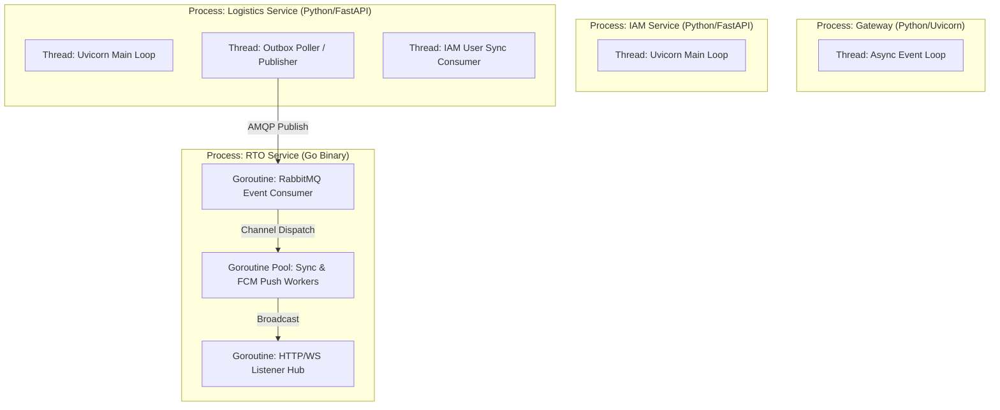

### 5.2 Scenario Sequence Diagram (Process Inter-Communication)
Detailed interaction between process execution boundaries during high-concurrency event handling.

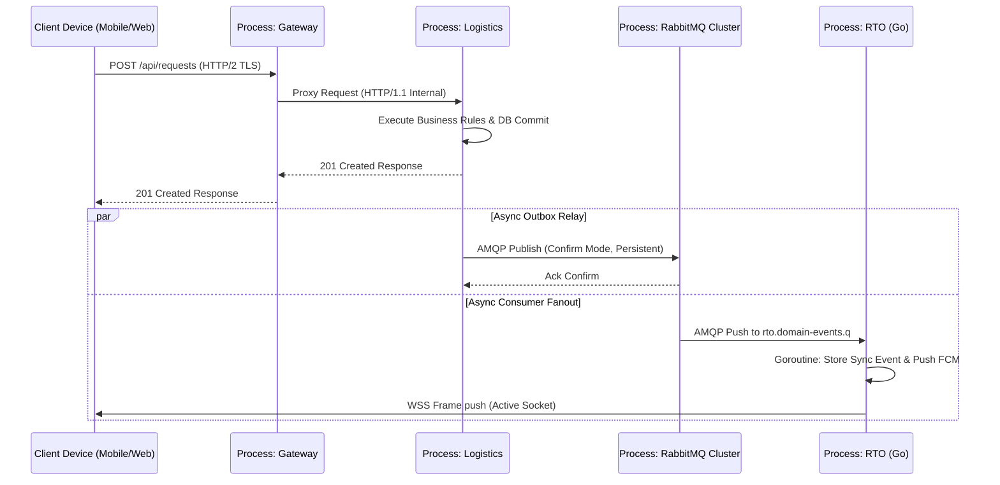

### 5.3 Activity Diagram (With Fork, Join, and Merge Nodes)
The Activity Diagram models the dynamic operational workflow of **Crisis Relief Request Handling & Dual-Path Verification/Dispatch**, highlighting control flow, forks, joins, and merges.

```mermaid
graph TD
    A([Initial Node: Request Received]) --> B[Validate JSON Schema & Auth Token]
    B --> C{Form Valid?}
    
    C -- No --> D[Return 400 Bad Request] --> E([Final Node])
    C -- Yes --> F[Save Help Request as PENDING]
    
    F --> FORK1=======
    
    FORK1 ======= --> G[Check Inventory Availability]
    FORK1 ======= --> H[Notify Area Coordinator]
    
    G --> I{Stock Available?}
    I -- Yes --> J[Reserve Stock SELECT FOR UPDATE]
    I -- No --> K[Flag for External Procurement Pledges]
    
    J --> MERGE1{Merge Inventory Status}
    K --> MERGE1
    
    MERGE1 --> JOIN1=======
    H --> JOIN1=======
    
    JOIN1======= --> L[Update Request to APPROVED]
    L --> M[Publish logistics.request.approved Outbox Event]
    M --> N([Final Node: Workflow Complete])

    style FORK1 fill:#333,stroke:#333,stroke-width:4px
    style JOIN1 fill:#333,stroke:#333,stroke-width:4px
    style A fill:#00c853,stroke:#333,stroke-width:2px
    style E fill:#d50000,stroke:#333,stroke-width:2px
    style N fill:#d50000,stroke:#333,stroke-width:2px
```

---

## 6. Data Schema View

### 6.1 Schema Isolation Architecture
The platform enforces strict schema isolation across four dedicated schemas within PostgreSQL. Access is restricted at the database role level (`GRANT` privileges); cross-schema foreign keys are forbidden. Cross-service data linkage uses bare logical UUIDs.

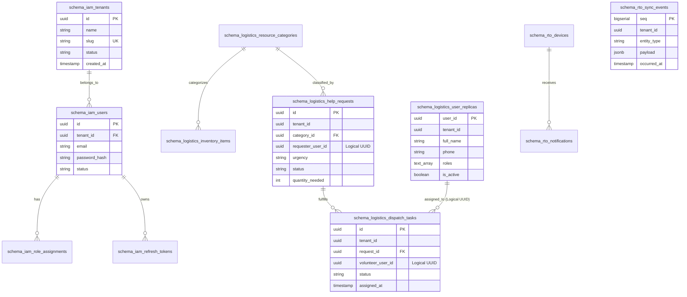

### 6.2 Outbox & Idempotency Table Specifications
Every domain service containing transactional state contains two infrastructural tables:

1. **`outbox` Table Specification:**
   * `id` (`UUID PK`): Unique identifier of the outbox record.
   * `event_id` (`UUID UNIQUE`): Event idempotency key.
   * `event_type` (`VARCHAR(128)`): e.g., `logistics.task.assigned`.
   * `routing_key` (`VARCHAR(128)`): RabbitMQ routing topic key.
   * `payload` (`JSONB`): Full fat event payload adhering to JSON schema.
   * `created_at` (`TIMESTAMPTZ`): Insert timestamp.
   * `published_at` (`TIMESTAMPTZ NULL`): Nullable completion marker set by relay worker upon AMQP publisher confirm.

2. **`processed_events` Table Specification:**
   * `event_id` (`UUID PK`): Consumer-side idempotency key.
   * `processed_at` (`TIMESTAMPTZ`): Timestamp of transaction completion.

---

## 7. Development View (Implementation View)

### 7.1 Monorepo Module & Artifact Structure
The Development View describes the static organization of source code, shared packages, build dependencies, and deployment binaries.

```
rcp-platform/
├── gateway/                             # API Gateway Module (FastAPI)
│   ├── app/
│   │   ├── main.py                      # Application entrypoint
│   │   ├── proxy.py                     # HTTP Reverse Proxy
│   │   └── ratelimit.py                 # Token-bucket rate limiter
│   └── Dockerfile                       # Build Artifact: gateway:latest
├── services/
│   ├── iam/                             # Identity & Access Management Service
│   │   ├── app/
│   │   │   ├── api/                     # REST API Controllers
│   │   │   ├── core/                    # Security, Argon2, RS256 Key Management
│   │   │   ├── models/                  # SQLAlchemy ORM -> schema_iam
│   │   │   └── events/publisher.py      # Outbox Publisher
│   │   └── Dockerfile                   # Build Artifact: rcp-iam:latest
│   ├── logistics/                       # Core Logistics & Dispatch Service
│   │   ├── app/
│   │   │   ├── api/                     # Category, Request, Inventory Routers
│   │   │   ├── models/                  # ORM -> schema_logistics
│   │   │   └── events/consumers/        # IAM Event Consumer (user_replicas)
│   │   └── Dockerfile                   # Build Artifact: rcp-logistics:latest
│   └── rto/                             # Real-Time Operations Engine (Go)
│       ├── cmd/server/main.go           # Go Executable Entrypoint
│       ├── internal/ws/                 # WebSocket Hub & Connection Registry
│       ├── internal/consumer/           # AMQP Consumer Group
│       └── Dockerfile                   # Build Artifact: rcp-rto:latest
├── packages/
│   ├── contracts/                       # Shared Source of Truth (AsyncAPI + JSON Schemas)
│   ├── common/                          # Shared Python Library (rcp-common)
│   └── clients/                         # Inter-service HTTP Clients (rcp-clients)
└── infra/
    ├── compose/docker-compose.yml       # Local Dev Orchestration
    └── terraform/                       # Infrastructure as Code
```

### 7.2 Source & Artifact Dependency Graph

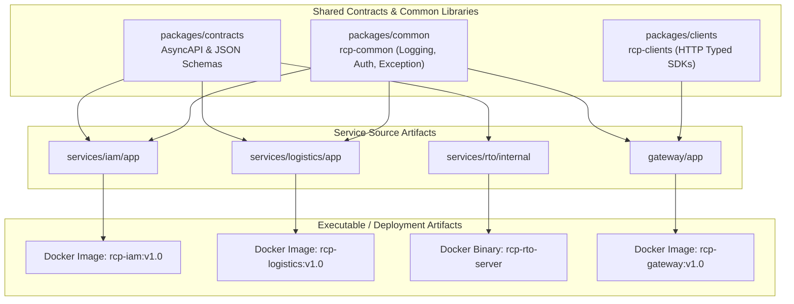

---

## 8. Physical View / Deployment View

### 8.1 Hardware Topology & Computing Nodes
The Physical View describes the mapping of software execution units to physical/virtual hardware nodes, networking infrastructure, and security boundaries.

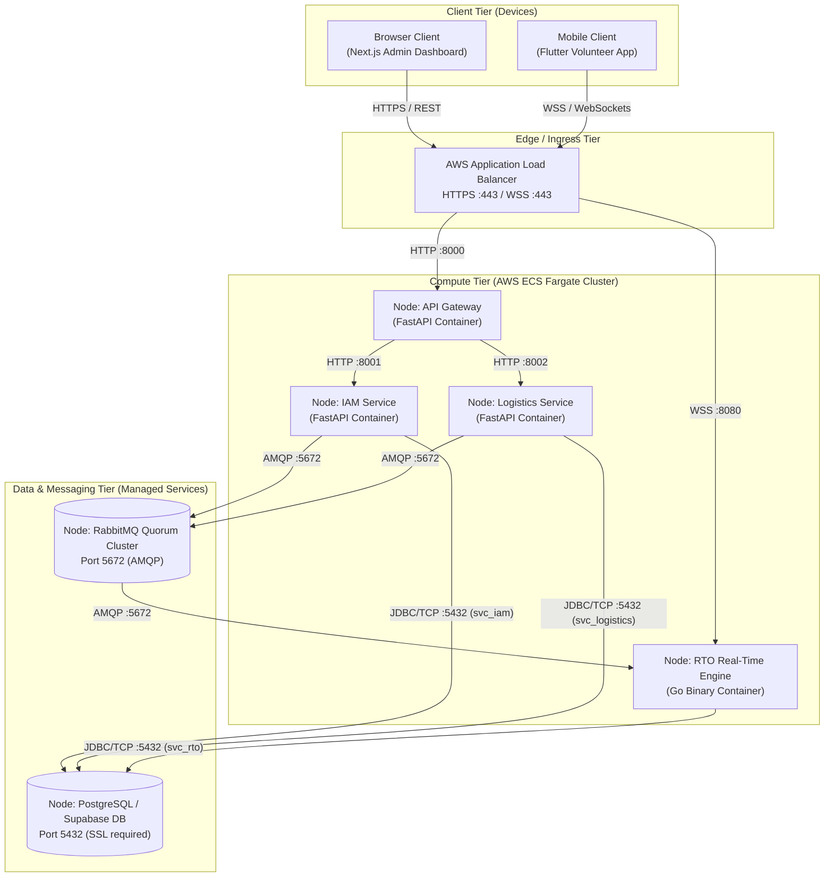

### 8.2 Deployment Artifact Constraints & Specifications

| Component | Target Platform | Min vCPU / RAM | Scaling Metric | Network Protocols |
|---|---|---|---|---|
| **API Gateway** | ECS Fargate (Linux/amd64) | 0.5 vCPU / 1 GB | Request Count / Target Latency | HTTP/1.1, HTTP/2, WSS |
| **IAM Service** | ECS Fargate (Linux/amd64) | 0.5 vCPU / 1 GB | CPU Utilization (>70%) | HTTP/1.1 REST |
| **Logistics Service** | ECS Fargate (Linux/amd64) | 1.0 vCPU / 2 GB | CPU Utilization (>70%) | HTTP/1.1 REST, AMQP 0-9-1 |
| **RTO Engine** | ECS Fargate (Linux/amd64) | 1.0 vCPU / 2 GB | **Active Connection Count (>5000)** | WSS, AMQP 0-9-1 |
| **PostgreSQL** | Supabase Enterprise | 4 vCPU / 16 GB | Storage / IOPS | TCP/IP PostgreSQL Wire Protocol |
| **RabbitMQ** | CloudAMQP 3-Node Quorum | 2 vCPU / 4 GB | Queue Depth / Unacked Messages | AMQP 0-9-1, TLS |

---

## 9. Interfaces Specification

### 9.1 Programmatic & REST Interfaces
All HTTP services expose OpenAPI 3.0 documentation at `/docs`. Below is the interface specification for core service interactions.

#### 9.1.1 IAM Service (`services/iam`)
* `POST /api/auth/login`: Provided interface for user authentication. Expects `tenant_slug`, `email`, `password`. Returns RS256 Bearer JWT & Refresh Token.
* `GET /.well-known/jwks.json`: Provided interface for public key verification. Used asynchronously by Go RTO and API Gateway.

#### 9.1.2 Logistics Service (`services/logistics`)
* `POST /api/logistics/requests`: Provided interface for creating help requests. Validates JSON schema against custom category definitions.
* `POST /api/logistics/dispatch`: Provided interface to assign tasks to volunteers. Atomically updates request state and writes to outbox.

### 9.2 Message-Based & Async Interfaces (RabbitMQ)
All asynchronous event exchanges conform to versioned JSON Schemas in `packages/contracts`.

* **Broker Topology:**
  * Exchange: `rcp.events` (Topic, Durable)
  * Dead-Letter Exchange: `rcp.dlx` (Topic, Durable)
  * Queue: `logistics.iam-events.q` (Quorum Queue)
  * Queue: `rto.domain-events.q` (Quorum Queue)

* **Envelope Specification:**
```json
{
  "event_id": "7f3b9c1e-2d4a-4f6b-9e8d-1a2b3c4d5e6f",
  "event_type": "logistics.task.assigned",
  "schema_version": 1,
  "occurred_at": "2026-08-04T09:41:22.318Z",
  "tenant_id": "c2a7e5d0-8b91-4c3f-a6d2-0f9e8d7c6b5a",
  "producer": "logistics-service",
  "trace_id": "00-4bf92f3577b34da6a3ce929d0e0e4736-00f067aa0ba902b7-01",
  "data": {
    "task_id": "a1b2c3d4-e5f6-4a5b-8c7d-9e0f1a2b3c4d",
    "request_id": "d4c3b2a1-f6e5-4b5a-7d8c-0f9e2b1a4c3d",
    "title": "Deliver 20 water containers to Ward 12 shelter",
    "priority": "high",
    "volunteer": { "user_id": "5a4b3c2d-...", "full_name": "Nimal Perera" }
  }
}
```

---

## 10. Size, Scale, and Performance

### 10.1 System Capacity & Scale Metrics
The platform is architected to handle extreme crisis-scale traffic asymmetries, where read operations and real-time pushes spike by 100× while coordinator write operations remain modest.

* **Target Concurrent Online Users:** 100,000 active volunteers across multiple regional tenants.
* **Concurrent Active WebSockets:** Up to 50,000 persistent WSS connections managed by the Go RTO engine.
* **Peak Event Throughput:** 10,000 AMQP messages per second sustained over RabbitMQ Quorum queues.

### 10.2 Performance Specifications & Architectural Enablement

| Metric / Event | Target Value | Architectural Enablement Mechanism |
|---|---|---|
| **JWT Verification Latency** | < 1 ms | Pure local cryptographic RS256 verification via cached JWKS in Go memory; zero DB/HTTP calls. |
| **REST API Latency (p99)** | < 150 ms | Lightweight FastAPI controllers with async DB connections via SQLAlchemy 2.0 / asyncpg. |
| **WebSocket Delivery Latency** | < 50 ms | Go high-concurrency event hub utilizing lock-free channel fan-out and per-tenant connection registries. |
| **Offline Sync Delta Catchup** | < 500 ms | Monotonic indexing on `schema_rto.sync_events(tenant_id, seq)`; transfers minimum JSON delta. |
| **Outbox Relay Lag** | < 100 ms | `FOR UPDATE SKIP LOCKED` batching in Python relay loop + RabbitMQ publisher confirmations. |

---

## 11. Quality Attributes & Non-Functional Requirements

### 11.1 Reliability & Mean-Time Between Failure (MTBF)
* **Target MTBF:** > 720 hours (30 days uninterrupted crisis operation).
* **Zero Message Loss Contract:** Guaranteed via transactional outbox at producer, persistent AMQP messaging (`delivery_mode=2`), RabbitMQ Raft-replicated quorum queues, and consumer manual ACKs post-DB commit.
* **Idempotency:** Enforced via `processed_events(event_id)` primary key constraints on all event consumers.

### 11.2 Availability & Fault Tolerance
* **Target Availability:** 99.95% operational uptime.
* **Unscheduled Downtime Mitigation:** Degraded mode execution. If IAM service becomes unavailable, existing active WebSocket connections and valid cached unexpired JWTs continue operating without interruption.

### 11.3 Extensibility
* **Dynamic Workflow & Form Engine:** Resource categories support custom JSONB form schemas and state machine definitions without requiring database migrations or code redeployment.
* **Versioned Schema Contracts:** Event schemas utilize strict semver schema names (`task-assigned.v1.schema.json`). Consumers ignore unexpected additive fields.

### 11.4 Portability & Infrastructure Independence
* Containerized execution via Docker (Linux alpine/slim base images).
* Fully defined Infrastructure as Code (IaC) using modular Terraform supporting deployment across AWS ECS Fargate, Supabase, and CloudAMQP.

---

## 12. Architectural Patterns & Design Styles

### 12.1 Model-View-Controller (MVC) Architectural Pattern
The application applies the classic **MVC pattern** to separate presentation logic, domain data, and user interaction control:

* **Context:** Interactive web administration (Next.js) and mobile volunteer applications (Flutter) consuming backend APIs.
* **Problem:** UI components are subject to frequent changes, platform look-and-feel requirements differ, and business rules must be protected from presentation leakage.
* **Solution Structure:**
  * **Model:** DB entities (`HelpRequest`, `InventoryItem`, `User`) and service engines (`DispatchEngine`, `IAMManager`) containing processing logic and data models.
  * **View:** Next.js Web Admin dashboard components and Flutter mobile views displaying real-time task states.
  * **Controller:** FastAPI endpoint routers (`/api/logistics/requests`) and Go WebSocket frame handlers that capture user inputs, invoke model routines, and return state responses.
* **Observer Pattern Integration:** Changes made to the Model by controllers trigger domain events published to RabbitMQ. The RTO engine acts as an **Observer**, propagating state changes asynchronously to active Views.

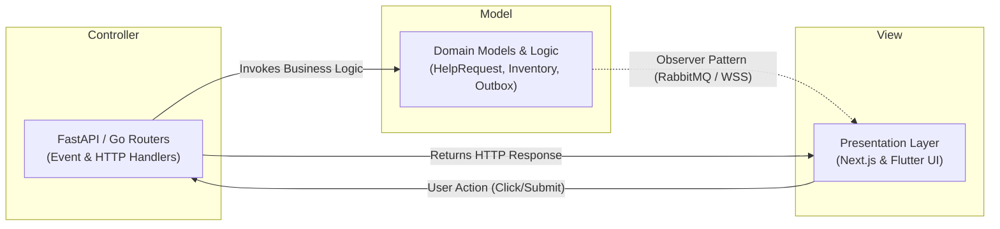

### 12.2 Three-Layered Architectural Pattern
Within each microservice boundary, execution code is organized into a strict **Three-Layered Pattern**:

1. **Presentation Layer:** REST Controllers, OpenAPI schemas, and WebSocket frame encoders (`app/api/`).
2. **Domain / Business Logic Layer:** Service managers, workflow state machines, and outbox event generators (`app/services/`).
3. **Data Access Layer:** SQLAlchemy ORM models, Database sessions (`app/models/`, `app/db/`), and raw SQL queries bound strictly to individual DB roles (`svc_iam`, `svc_logistics`, `svc_rto`).

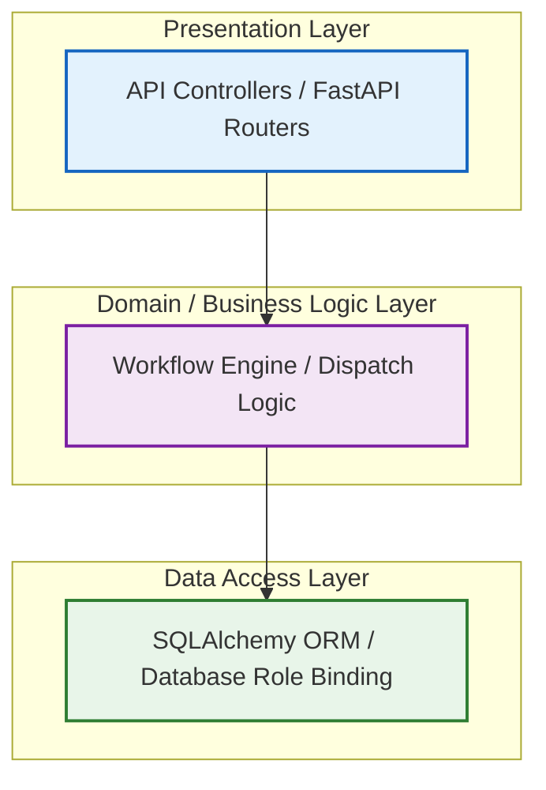

* **Layer Isolation Rule:** Interactions pass sequentially down adjacent layers. Direct access from Presentation to Data Access bypasses domain logic and is prohibited.

---

## 13. Architectural Mappings & Traceability

To ensure end-to-end consistency, the matrix below maps system requirements and use cases to their realizing logical components, process units, development artifacts, and deployment nodes.

| Requirement / Use Case | Logical Class / Interface | Process Execution Unit | Development Artifact | Physical Deployment Node |
|---|---|---|---|---|
| **UC-01: Tenant Onboarding** | `IAMManager` / `POST /api/auth/tenants` | Uvicorn Main Loop (`svc_iam`) | `services/iam/app/api/tenants.py` | `Node: IAM Container` |
| **UC-03: Inventory Reservation** | `DispatchEngine` / `allocateStock()` | Uvicorn Main Loop (`svc_logistics`) | `services/logistics/app/services/inventory.py` | `Node: Logistics Container` |
| **UC-04: Task Dispatch** | `DispatchController` / `OutboxRelay` | Outbox Poller Thread | `services/logistics/app/events/publisher.py` | `Node: Logistics Container` |
| **UC-05: Real-Time Event Fanout** | `WebSocketHub` / `SyncEngine` | AMQP Consumer Goroutine | `services/rto/internal/consumer/` | `Node: RTO Go Container` |
| **UC-06: Offline Cursor Sync** | `SyncEngine` / `streamDeltas()` | HTTP/WS Listener Goroutine | `services/rto/internal/sync/` | `Node: RTO Go Container` |
| **Authentication & Verification** | `AuthController` / `GET /.well-known/jwks.json` | RS256 Verification Routine | `packages/common/auth/` | `Node: All Microservices` |

---
*End of Software Architecture and Design Document (SDD / SAD).*
