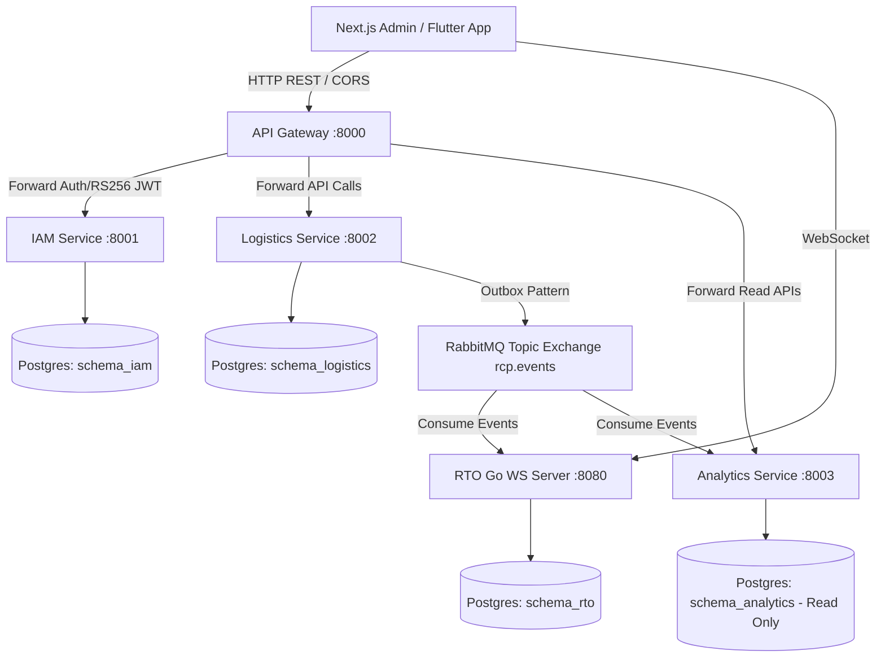

# Resource Coordination Platform (RCP) — Software Requirements Specification (SRS)

**Document Version:** 1.0.0  
**Date:** August 4, 2026  
**Status:** Approved / Mid-Evaluation Benchmark  
**System Name:** Resource Coordination Platform (RCP)

---

## 1. Introduction

### 1.1 Purpose
This Software Requirements Specification (SRS) details the functional, non-functional, and interface requirements for the **Resource Coordination Platform (RCP)** backend. RCP is a multi-tenant, event-driven, offline-first SaaS platform designed for community-based organizations (CBOs) and relief agencies to manage crisis resource requests, inventory tracking, volunteer dispatch, and real-time operational coordination.

### 1.2 Scope
The scope of the backend system includes:
- **API Gateway (`gateway`)**: Multi-tenant request routing, RS256 JWT validation, rate limiting, and CORS handling.
- **Identity & Access Management (`services/iam`)**: Tenant onboarding, RBAC user management, RS256 key pair management, and JWKS endpoints.
- **Logistics Service (`services/logistics`)**: Resource requests, dynamic category schemas, inventory tracking, pledged offers, volunteer registration, and task dispatching.
- **Real-Time Operations Service (`services/rto`)**: High-performance Go WebSocket server, FCM push notification dispatch, and monotonic event cursor sync for offline clients.
- **Analytics Service (`services/analytics`)**: Read-only KPI dashboards, aggregation projections, and operational reports.
- **Contracts & Common Libraries (`packages/`)**: Centralized AsyncAPI/JSON Schema event definitions (`packages/contracts`) and shared Python utilities (`packages/common`).

---

## 2. Overall Description

### 2.1 User Personas & Roles

| Role | Key Responsibilities | Access Scope |
|---|---|---|
| **Super Admin** | Platform management, tenant creation, system monitoring | Global across all tenants |
| **Tenant Admin** | Organization setup, user management, policy configuration | Tenant-isolated (`tenant_id`) |
| **Crisis Coordinator** | Inventory management, request review, volunteer task dispatch | Tenant-isolated (`tenant_id`) |
| **Field Volunteer** | Task execution, inventory pickup/delivery, offline status updates | Tenant-isolated + assigned tasks |
| **Relief Requester** | Submitting resource requests, tracking request fulfillment status | Public / Tenant-scoped |

### 2.2 System Architecture Overview

---

## 3. Functional Requirements & Code Alignment

### 3.1 Identity & Access Management (IAM)

* **FR-IAM-01 (Tenant Onboarding)**: System shall support registering new organizational tenants and creating initial seed admin accounts.
  * **Code Alignment**: [`services/iam/app/api/v1/tenants.py`](file:///d:/Resource%20Coordination%20Platform/services/iam/app/api/v1/tenants.py), [`services/iam/app/services/tenant_service.py`](file:///d:/Resource%20Coordination%20Platform/services/iam/app/services/tenant_service.py)
* **FR-IAM-02 (Authentication & RS256 JWT Issuance)**: System shall authenticate users via tenant-scoped credentials and issue RS256 signed JWT tokens.
  * **Code Alignment**: [`services/iam/app/api/v1/auth.py`](file:///d:/Resource%20Coordination%20Platform/services/iam/app/api/v1/auth.py), [`packages/common/rcp_common/auth/jwt.py`](file:///d:/Resource%20Coordination%20Platform/packages/common/rcp_common/auth/jwt.py)
* **FR-IAM-03 (JWKS Endpoint)**: System shall expose a JSON Web Key Set (`/.well-known/jwks.json`) for downstream token verification.
  * **Code Alignment**: [`services/iam/app/api/v1/jwks.py`](file:///d:/Resource%20Coordination%20Platform/services/iam/app/api/v1/jwks.py)

### 3.2 Logistics & Inventory Coordination

* **FR-LOG-01 (Crisis Resource Requests)**: System shall record resource requests with priority scores, dynamic schemas, and location coordinates.
  * **Code Alignment**: [`services/logistics/app/api/v1/requests.py`](file:///d:/Resource%20Coordination%20Platform/services/logistics/app/api/v1/requests.py), [`services/logistics/app/models/request.py`](file:///d:/Resource%20Coordination%20Platform/services/logistics/app/models/request.py)
* **FR-LOG-02 (Atomic Inventory Reservation)**: System shall prevent double-allocation using database row-level locking (`SELECT FOR UPDATE`) during inventory reservations.
  * **Code Alignment**: [`services/logistics/app/services/inventory_service.py`](file:///d:/Resource%20Coordination%20Platform/services/logistics/app/services/inventory_service.py)
* **FR-LOG-03 (Volunteer Dispatch)**: System shall assign field volunteers to dispatch tasks and emit `dispatch.created` fat events.
  * **Code Alignment**: [`services/logistics/app/api/v1/dispatches.py`](file:///d:/Resource%20Coordination%20Platform/services/logistics/app/api/v1/dispatches.py)
* **FR-LOG-04 (Transactional Outbox Publishing)**: System shall save outbound events to an `outbox` table within the same DB transaction to guarantee event emission to RabbitMQ.
  * **Code Alignment**: [`services/logistics/app/events/outbox.py`](file:///d:/Resource%20Coordination%20Platform/services/logistics/app/events/outbox.py)

### 3.3 Real-Time Operations (RTO) & Offline Sync

* **FR-RTO-01 (WebSocket Event Streaming)**: System shall deliver real-time operational events to connected mobile/web clients over WebSockets.
  * **Code Alignment**: [`services/rto/internal/ws/manager.go`](file:///d:/Resource%20Coordination%20Platform/services/rto/internal/ws/manager.go)
* **FR-RTO-02 (Monotonic Cursor Replay)**: System shall allow offline clients to reconnect and replay missed events using a monotonic `sync_cursor`.
  * **Code Alignment**: [`services/rto/internal/sync/handler.go`](file:///d:/Resource%20Coordination%20Platform/services/rto/internal/sync/handler.go)
* **FR-RTO-03 (RabbitMQ Event Consumption)**: Go RTO server shall consume messages from RabbitMQ topic exchanges and update event stores idempotently.
  * **Code Alignment**: [`services/rto/internal/consumer/rabbitmq.go`](file:///d:/Resource%20Coordination%20Platform/services/rto/internal/consumer/rabbitmq.go)

---

## 4. Non-Functional Requirements (NFRs)

| ID | Requirement | Target Metric / Solution | Code / Infra Location |
|---|---|---|---|
| **NFR-01** | **Multi-Tenant Isolation** | Schema separation + mandatory `tenant_id` context check on all API routes | [`gateway/app/main.py`](file:///d:/Resource%20Coordination%20Platform/gateway/app/main.py), Postgres Schemas |
| **NFR-02** | **Eventual Consistency** | Transactional Outbox + RabbitMQ Quorum Queues (Zero message loss) | [`packages/contracts/events/`](file:///d:/Resource%20Coordination%20Platform/packages/contracts/events/) |
| **NFR-03** | **Offline Resiliency** | Client-side SQLite cache + Server Monotonic Cursor Replay | [`services/rto/internal/sync/`](file:///d:/Resource%20Coordination%20Platform/services/rto/internal/sync/) |
| **NFR-04** | **Concurrency Safety** | `SELECT FOR UPDATE` on inventory allocations under high load | [`services/logistics/app/services/inventory_service.py`](file:///d:/Resource%20Coordination%20Platform/services/logistics/app/services/inventory_service.py) |
| **NFR-05** | **Security & Auth** | Asymmetric RS256 JWT tokens with public JWKS verification | [`packages/common/rcp_common/auth/`](file:///d:/Resource%20Coordination%20Platform/packages/common/rcp_common/auth/) |

---

## 5. Challenges Faced & Solutions

1. **Challenge: Concurrency & Double Allocation in Inventory Reservations**
   - *Problem*: Simultaneous dispatch requests by multiple coordinators during crisis spikes could over-allocate available stock.
   - *Solution*: Implemented pessimistic row-locking (`SELECT FOR UPDATE`) within explicit DB transactions in PostgreSQL logistics schema.

2. **Challenge: Network Unreliability & Event Loss for Field Volunteers**
   - *Problem*: Mobile apps in flood/disaster areas lose cell connectivity, missing live notifications.
   - *Solution*: Developed a monotonic `sync_cursor` pattern in the Go RTO service, backed by PostgreSQL event logging, enabling full offline catch-up upon reconnection.

3. **Challenge: Dual-write Failure between DB and Message Broker**
   - *Problem*: DB commit succeeds but RabbitMQ publish fails (or vice versa), leading to data inconsistency across microservices.
   - *Solution*: Implemented the **Transactional Outbox Pattern** — events are written to the database outbox table in the same transaction, then asynchronously relayed to RabbitMQ by a worker daemon.

4. **Challenge: High Concurrent WebSocket Connections**
   - *Problem*: Python async WS loop could become a bottleneck under high client connection counts.
   - *Solution*: Built the RTO service in **Go**, utilizing goroutines and channels for low-latency, lightweight WebSocket connection handling.

---

## 6. System Testing Strategy

### 6.1 Unit Testing Strategy
- **Python Services (IAM, Logistics, Analytics)**:
  - Framework: `pytest` + `pytest-asyncio`.
  - Strategy: Test core domain logic, schema validation, and service classes in isolation by mocking DB sessions (`AsyncMock`) and event publishers.
  - Commands: `pytest services/iam/tests`, `pytest services/logistics/tests`.
- **Go Service (RTO)**:
  - Framework: Native Go `testing` package.
  - Strategy: Unit test sync cursor calculations, JSON event parsing, and WebSocket token authentication logic.
  - Command: `go test ./...` in `services/rto`.

### 6.2 Integration Testing Strategy
- **Containerized Integration Suite**:
  - Utilizes Docker Compose (`infra/compose/docker-compose.yml`) or `Testcontainers-python`.
  - Tests actual PostgreSQL schema migrations, outbox event generation, and RabbitMQ topic exchange routing.
  - Validates that published events adhere strictly to JSON Schemas in `packages/contracts/events/`.

### 6.3 End-to-End (E2E) Testing Strategy
- **Gateway to Service Flow**:
  - Postman / Newman collection execution against Gateway (`http://localhost:8000`).
  - Sequence: Onboard Tenant $\rightarrow$ Login Admin $\rightarrow$ Submit Request $\rightarrow$ Add Inventory $\rightarrow$ Dispatch Task $\rightarrow$ Verify Outbox Event.
- **WebSocket & Offline Replay Verification**:
  - Custom test script connecting to `ws://localhost:8080/ws` with Bearer token, disconnecting, triggering background events, reconnecting with `sync_cursor`, and asserting all missed messages are replayed sequentially.

---

## 7. Proposal Timeline Alignment & Progress Matrix

| Proposal Milestone | Key Deliverables | Planned Target | Status / Progress |
|---|---|---|---|
| **Milestone 1: Platform Foundation & Auth** | Multi-tenant DB setup, API Gateway, IAM service with RS256 JWT & JWKS | Weeks 1 – 3 | **100% Completed** |
| **Milestone 2: Core Logistics Engine** | Requests, dynamic schemas, inventory tracking, outbox pattern, RabbitMQ event bus | Weeks 4 – 7 | **100% Completed** |
| **Milestone 3: Real-Time & Offline Sync (Mid-Eval)** | Go WebSocket server, monotonic cursor replay, push notifications | Weeks 8 – 10 | **100% Completed (Mid-Eval Benchmark)** |
| **Milestone 4: Analytics & Hardening** | Analytics read-model projections, stress testing, E2E validation, CI/CD pipelines | Weeks 11 – 14 | *Planned for Final Evaluation* |
